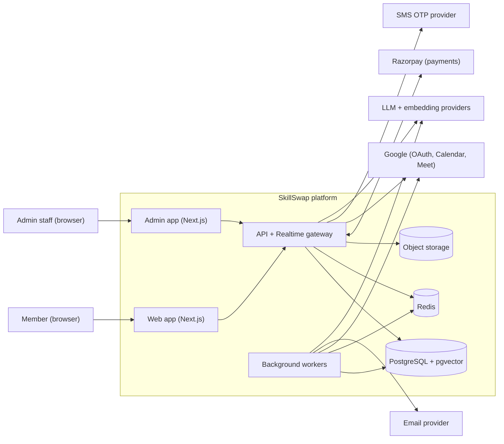
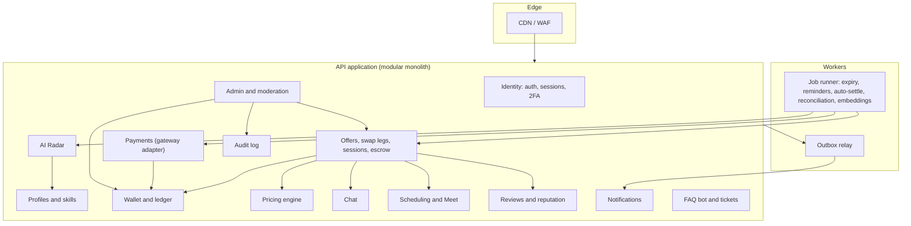
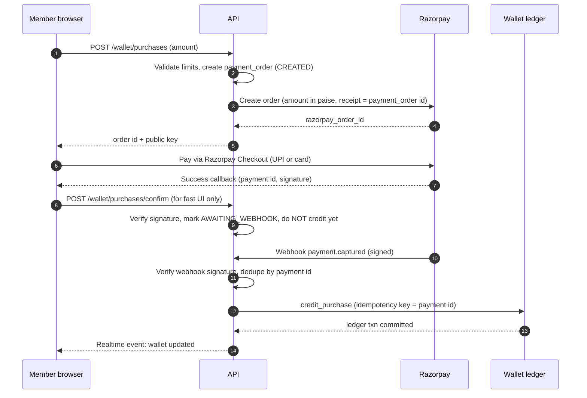
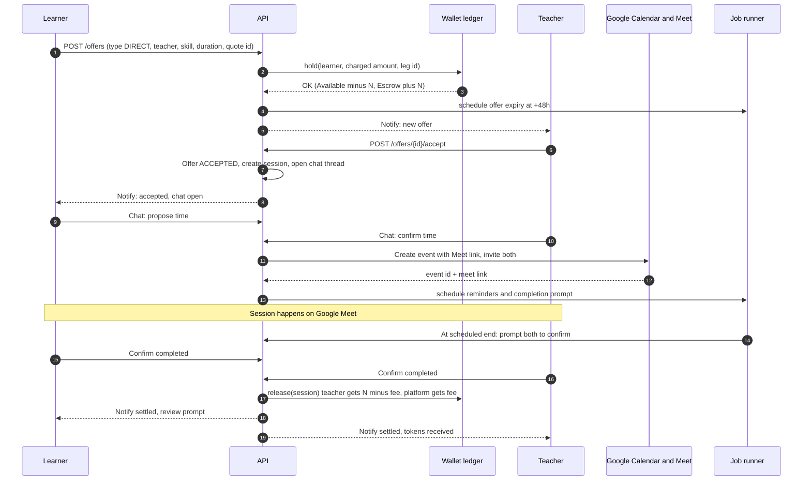
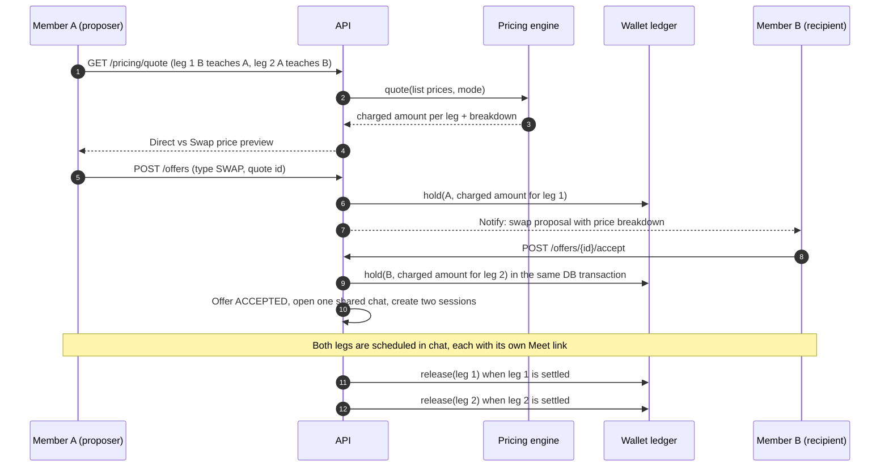
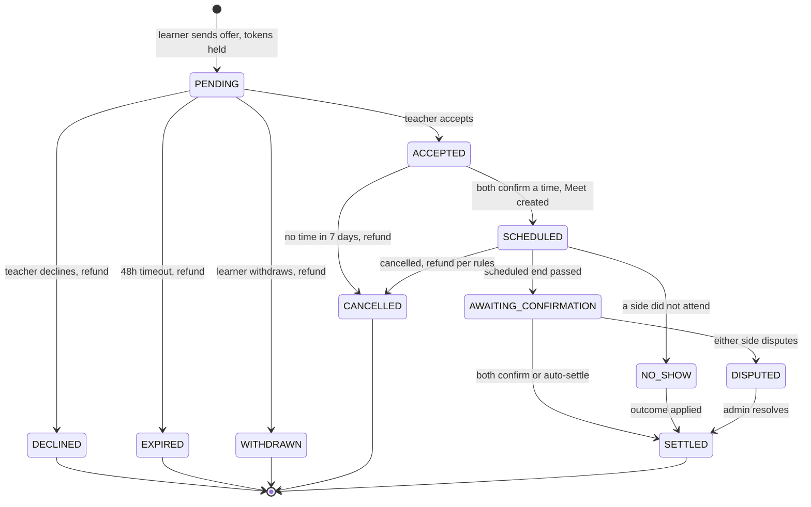
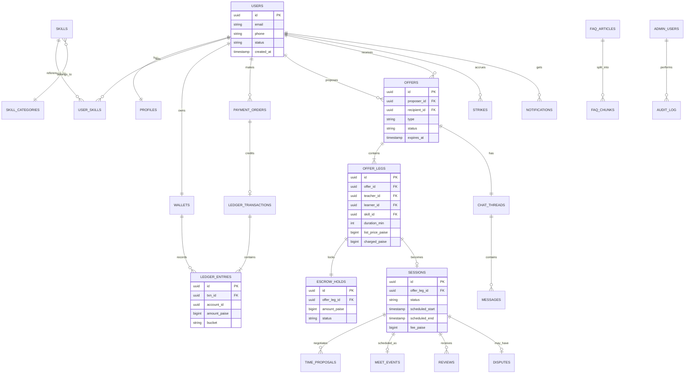
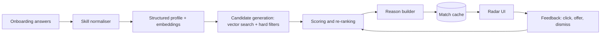
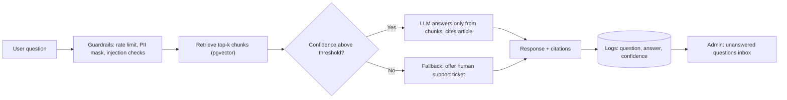
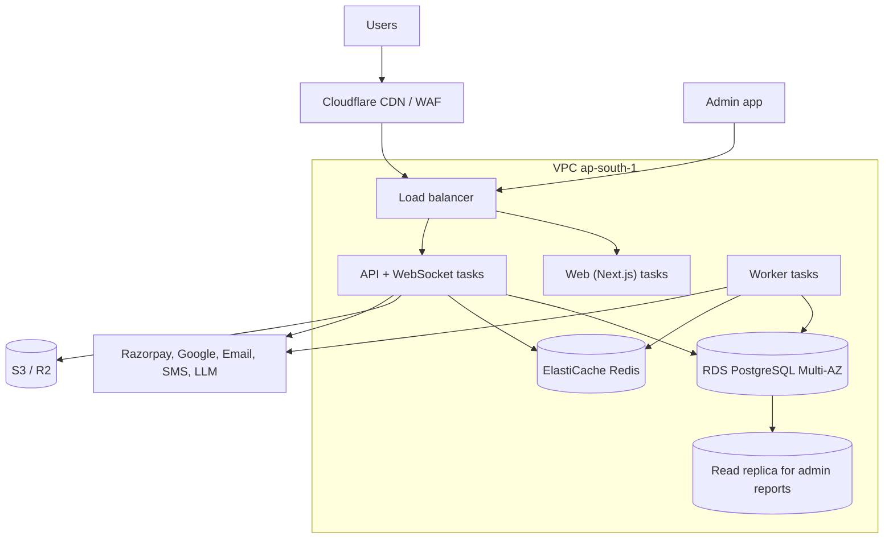

# SkillSwap — Architecture

| | |
|---|---|
| **Version** | 0.2 — draft for review (swap model made core) |
| **Date** | 29 Sep 2026 |
| **Companion doc** | `PRD.md` (requirement IDs like FR-WAL-03 refer to it) |
| **Audience** | Engineers building the MVP, plus anyone reviewing technical risk |

---

## 1. Purpose and scope

This document describes how to build SkillSwap: a web application where members buy **tokens (1 token = ₹1)**, send token-backed **offers** to other members — either a **direct** purchase or a much cheaper **skill swap** in which the two members teach each other — and, once the other member approves, chat in a **temporary chat**, schedule a **Google Meet**, and settle through **escrow**. It also covers the **AI Radar** matcher, **FAQ chatbot**, **payment gateway**, **authentication**, and **admin panel**.

It is written for an MVP-scale team, so it favours a **modular monolith** with clear seams over microservices, and pushes complexity into the one place where it is unavoidable: the **money ledger**.

---

## 2. Architecture drivers

| Driver | Consequence for design |
|---|---|
| **Money integrity is non-negotiable** | Double-entry ledger in PostgreSQL, atomic transactions, idempotency keys, nightly reconciliation |
| **India-first payments** | Razorpay (UPI/cards/netbanking) behind a provider interface; INR only; amounts stored as integer paise |
| **Small team, fast delivery** | Modular monolith, managed services, one language (TypeScript) end to end |
| **Real-time interaction** | WebSocket chat and live notifications; background workers for timers |
| **Time-based state changes** | Reliable delayed jobs (expiry, reminders, auto-settle) with a sweeper as a safety net |
| **Third-party fragility** | Google Meet, gateway, email and LLM providers can all fail — every integration has a fallback or retry path |
| **Two pricing modes (swap vs direct)** | Deterministic pricing engine with quote snapshots; a swap is one offer with two independently-escrowed legs |
| **Trust and safety** | Full audit trail, moderation tooling, RBAC and 2FA for admins |
| **Explainable, cheap AI** | Hybrid matching (embeddings + rules); LLM only where it adds value; RAG-only chatbot |

---

## 3. System context

---

## 4. Reference tech stack

| Layer | Choice | Notes / alternatives |
|---|---|---|
| **Frontend** | Next.js (App Router) + TypeScript, Tailwind CSS, React Query | SSR for public profile/SEO pages; client components for chat and dashboards |
| **Admin UI** | Separate Next.js app on `admin.` subdomain | Shares UI library and API client; independent deploy and stricter security headers |
| **Backend API** | Node.js + TypeScript, **NestJS** modular monolith | Alternative: Next.js route handlers for a leaner start (see §4.1) |
| **Realtime** | Socket.IO (WebSocket with fallback) with Redis adapter | Alternative: managed realtime (Supabase Realtime, Ably) |
| **Database** | **PostgreSQL 16** + `pgvector` extension | One database for relational data, ledger and embeddings — fewer moving parts |
| **ORM / migrations** | Prisma or Drizzle; raw SQL for ledger operations | Ledger code should be explicit SQL in transactions |
| **Cache / queues** | Redis + BullMQ | Delayed jobs, rate limiting, presence, socket adapter |
| **Object storage** | S3-compatible (AWS S3 / Cloudflare R2) | Avatars, proof documents, invoices |
| **Payments** | Razorpay (Orders API, Webhooks, Refunds API) | Behind `PaymentProvider` interface so Cashfree/PhonePe PG can be swapped in |
| **Auth** | Self-managed JWT sessions with Argon2id **or** a managed provider (Supabase Auth / Clerk / Auth0) | See §13.1 |
| **Google** | Google OIDC (login), Calendar API (event + Meet link) | See §11 |
| **Email** | Amazon SES / Resend / Postmark | Transactional templates |
| **SMS OTP** | MSG91 / Twilio Verify / other DLT-registered provider | India DLT registration required |
| **AI** | Hosted embedding model (multilingual) + a small fast LLM for chatbot and skill tagging | Provider-agnostic `LLMClient` and `EmbeddingClient` interfaces |
| **Hosting** | AWS `ap-south-1` (Mumbai) — ECS Fargate + RDS + ElastiCache; or Render/Railway for the first months | Region choice keeps latency low and data in India |
| **CDN / WAF** | Cloudflare | DDoS, bot protection, caching |
| **Observability** | Sentry, OpenTelemetry → Grafana/Datadog, structured JSON logs | |
| **CI/CD** | GitHub Actions; Terraform for infra | |

### 4.1 Lean variant (fastest path)
If the team already knows **Next.js + Supabase**, you can start with: Supabase Auth, Postgres (with `pgvector`), Realtime for chat, Edge Functions/route handlers for API, and Vercel for hosting. Rules if you go this way:
- All money operations (hold/release/refund/purchase) must run as **Postgres functions or server-only routes** using the service role — never from the browser client.
- Turn on Row Level Security for every table; the ledger tables get **no** client write policies.
- Move to a dedicated backend service if webhook volume, background-job complexity or admin tooling outgrows it.

The rest of this document is written to hold in both variants.

---

## 5. Logical architecture

One deployable API application, internally split into modules with strict boundaries (modules talk through service interfaces and domain events, never through each other's tables).

### 5.1 Module responsibilities

| Module | Owns | Key rules |
|---|---|---|
| **Identity** | users, credentials, OAuth links, sessions, 2FA, phone/email verification | Only module that touches password hashes; issues access/refresh tokens |
| **Profiles & skills** | profiles, skill taxonomy, user skills, availability, onboarding answers | Skill normalisation; suggested-skill moderation |
| **AI Radar** | embeddings, candidate generation, scoring, match cache, feedback | Read-only over profiles; never touches money |
| **Wallet & ledger** | accounts, ledger transactions/entries, balances | **The only module allowed to write ledger tables.** Exposes `hold`, `release`, `refund`, `credit_purchase`, `adjust` |
| **Payments** | payment orders, gateway events, refunds, reconciliation | Verifies signatures; calls Wallet on confirmed events only |
| **Offers & sessions** | offers (direct or swap), offer legs, sessions, escrow holds (reference), state machine, cancellations, strikes | Orchestrates Pricing, Wallet, Chat, Scheduling. One swap = one offer + two legs |
| **Pricing** | pricing quotes; reads swap factor and price bands from settings | Pure deterministic engine (§7.8); the only source of charged amounts |
| **Chat** | threads, messages, read receipts, moderation flags | Access strictly limited to the two participants (+ audited admin access) |
| **Scheduling** | time proposals, calendar events, Meet links, reminders | Wraps Google APIs with retry and manual fallback |
| **Reviews** | reviews, ratings aggregates | Double-blind reveal logic |
| **Notifications** | notification records, preferences, email/push delivery | Consumes domain events |
| **Support** | FAQ articles, chunks, bot conversations, tickets | RAG pipeline; ticket creation |
| **Admin & moderation** | RBAC, admin actions, moderation queues, config | Every mutation writes to Audit |
| **Audit** | append-only log | No update/delete permissions at DB level |

### 5.2 Cross-cutting patterns
- **Domain events + transactional outbox.** Modules write events (`OfferAccepted`, `SessionSettled`, …) to an `outbox` table in the same DB transaction as the state change. A relay publishes them to the job queue. This guarantees notifications and follow-up work happen exactly-once-ish without distributed transactions.
- **Idempotency everywhere money or external calls are involved** (see §7.4).
- **Config service.** Fees, limits and windows are read from a versioned `settings` table (cached), so admins can change them without deploys.
- **Feature flags** for risky or staged features (reciprocal swaps, withdrawals).

---

## 6. Core flows

### 6.1 Token purchase

Rules: the **webhook is the source of truth**. The client callback only improves UX. A reconciliation job (§14.3) catches missed webhooks.

### 6.2 Offer → approval → chat → schedule → settle

Failure branches (decline, expiry, cancellation, no-show, dispute) are covered by the state machine in §7.2.

### 6.3 Skill swap (two legs)

A swap is **one offer with two legs**: in leg 1 member B teaches member A, in leg 2 member A teaches member B. Each leg has its own escrow hold, session, Meet link and settlement; the two legs share one chat thread.

---

## 7. Money: ledger, escrow and state machines

This is the most important part of the system. It is deliberately boring and heavily tested.

### 7.1 Ledger model (double-entry)

**Units:** all amounts are stored as `BIGINT` **paise** (1 token = 100 units). No floating point anywhere. Fees are computed with integer maths and rounded half-up; the teacher gets `gross − fee`, so totals always balance.

**Accounts**

| Account | Owner | Meaning |
|---|---|---|
| `USER_AVAILABLE` | each user | Spendable tokens |
| `PLATFORM_ESCROW` | platform | All tokens currently held for offers/sessions (per-hold detail in `escrow_holds`) |
| `PLATFORM_REVENUE` | platform | Accumulated fees |
| `PLATFORM_CASH_CLEARING` | platform | Contra account representing rupees received via the gateway |
| `PLATFORM_PROMO_POOL` | platform | Source for bonus tokens (P1) |

**Transactions** are groups of `ledger_entries` that **sum to zero**:

| Type | Entries |
|---|---|
| `PURCHASE` | `CASH_CLEARING −X`, `USER_AVAILABLE(user) +X` |
| `HOLD` | `USER_AVAILABLE(learner) −N`, `ESCROW +N` |
| `RELEASE` | `ESCROW −N`, `USER_AVAILABLE(teacher) +(N−fee)`, `REVENUE +fee` |
| `REFUND` (to learner) | `ESCROW −N`, `USER_AVAILABLE(learner) +N` |
| `SPLIT` (partial refund / partial release) | `ESCROW −N`, plus learner, teacher and revenue entries summing to N |
| `ADJUSTMENT` (admin, maker-checker) | Counter-account is a designated platform adjustment account |
| `WITHDRAWAL` (P1) | `USER_AVAILABLE −X`, `CASH_CLEARING +X` |

**Swaps need no new ledger types.** A swap is two independent legs; each leg has its own `HOLD` (payer = that leg's learner) and its own `RELEASE` / `REFUND`. The ledger never knows about swaps — all swap logic lives in the Pricing and Offers modules.

### 7.2 State machines

**Offer / session lifecycle**

**Escrow hold:** `HELD → RELEASED | REFUNDED | SPLIT | FROZEN (during dispute)`. A hold reaches a terminal state exactly once; the transition and its ledger transaction commit together.

**Offers vs legs.** An `offers` row is the container (`PENDING → ACCEPTED | DECLINED | EXPIRED | WITHDRAWN`, then `COMPLETED` once every leg is terminal). Each `offer_legs` row carries its own escrow hold and its own session, and runs the lifecycle above from `ACCEPTED` onward independently. A direct offer has one leg; a swap has two. Cross-leg rules: before any leg has taken place, cancelling one leg cancels the swap and refunds both holds (by cancellation timing); after one leg has settled, a default on the other leg follows the default-handling rules in §7.8.

Every state transition is a single function `transition(entity, from, to, actor, reason)` that (1) checks the allowed-transitions table, (2) locks the row, (3) applies ledger effects, (4) writes an `outbox` event and an audit record — all in one DB transaction.

### 7.3 Balance safety
- Each user has one `wallets` row with `available_paise` (materialised from the ledger). Updates happen **in the same transaction** as ledger entries.
- `CHECK (available_paise >= 0)` on the column: an overdraft is physically impossible.
- Rows are locked with `SELECT … FOR UPDATE` in a deterministic order (by wallet id) to avoid deadlocks when two wallets are touched.
- For hold/release/refund, the escrow hold row is locked first, so two concurrent settlement attempts cannot both succeed.

### 7.4 Idempotency
| Operation | Idempotency key |
|---|---|
| Credit from payment | Razorpay `payment_id` (unique index on `ledger_transactions(type, external_ref)`) |
| Refund to card/UPI | Razorpay refund id / our refund request id |
| Hold | offer leg id |
| Release / refund of a hold | hold id + terminal state |
| Client-initiated POSTs | `Idempotency-Key` header stored for 24 h |
| Webhook processing | `gateway_events(event_id)` unique |

Replays return the stored result, never a second effect.

### 7.5 Invariants (checked nightly, alerts on violation)
1. Every ledger transaction sums to zero.
2. `Σ USER_AVAILABLE + ESCROW + REVENUE + …` equals `−CASH_CLEARING` (total tokens in circulation equals rupees received, net of withdrawals).
3. `ESCROW balance = Σ active escrow_holds`.
4. No user balance is negative.
5. Every `PURCHASE` entry maps to a captured gateway payment, and vice versa.

### 7.6 Chargebacks and clawbacks
On a gateway dispute/chargeback event: flag the payment, freeze the corresponding purchased tokens if unspent, claw back if possible; if the tokens were already spent, place the account in a restricted state and route to Finance in the admin panel. Bucket tracking (`PURCHASED`, `EARNED`, `PROMO`) on ledger entries is recommended from day one so future withdrawals can restrict *what* is withdrawable.

### 7.7 Time-based jobs
Delayed BullMQ jobs handle: offer expiry (+48 h), scheduling deadline (+7 d direct, +14 d for a swap's two legs), reminders (−24 h, −1 h), completion prompt (at end), auto-settle (+24 h), review window close (+7 d), chat archive. A **sweeper cron every 5 minutes** finds anything overdue in the database and processes it — so a lost Redis job never strands funds. All handlers are idempotent.

### 7.8 Pricing engine (direct vs swap)

SkillSwap's central promise is that **swapping is cheaper than buying**. The price a member pays is therefore computed by a small, pure, deterministic **pricing engine** — never typed in by the client — and stored as an immutable snapshot on the offer leg.

**Inputs** (per leg): the teacher's hourly rate (paise) × duration → `list_price`. Offer mode: `DIRECT` or `SWAP`. Config (versioned in `settings`): `swap_factor` *f* (default 0.30), `swap_min_charge` (default 10 tokens), platform fee %.

**Rules**
- `DIRECT`: `charged = list_price`.
- `SWAP` with legs 1 and 2: `M = min(list_1, list_2)` is the value exchanged in kind. For each leg *i*: `charged_i = min(list_i, max(swap_min_charge, (list_i − M) + round_half_up(f × M)))`.

| Example | list_1 | list_2 | Charged leg 1 | Charged leg 2 |
|---|---|---|---|---|
| Direct, learner-only | 60 | — | 60 | — |
| Swap, equal value | 60 | 60 | **18** | **18** |
| Swap, unequal value | 100 | 40 | **72** | **12** |

In the unequal case the 60-token imbalance still flows to the teacher of the more valuable skill, and each side also pays a small swap price.

**Properties (enforced by property-based tests):** `charged_i ≤ list_i` (a swap never costs more than direct); symmetric in the two legs; monotonic in list price; identical inputs always give identical outputs; all arithmetic in integer paise.

**Quotes.** `GET /pricing/quote` returns the breakdown for Direct and for Swap and stores a `pricing_quotes` row (inputs, outputs, config snapshot, 10-minute expiry). `POST /offers` must reference a live `quote_id`; the server recomputes and rejects if the result differs. Later config changes never alter accepted offers.

**Swap eligibility and abuse controls.** The discount applies only when both skills are active `TEACH` skills on the two members' profiles, the members are different people, and the pair is not flagged by linked-account / velocity checks (PRD FR-TS-03). Teacher rates are limited to an admin-defined min/max band per skill category so rates cannot be inflated to farm net token flows.

**Two-party escrow at acceptance.** For a swap, the proposer's leg is held when the proposal is sent. The recipient's leg is held **inside the same database transaction as the acceptance**, locking both wallets in id order. If the recipient's balance is insufficient the transaction rolls back, the offer stays `PENDING`, and the API returns `INSUFFICIENT_FUNDS` so the UI can prompt a top-up.

**Default handling (MVP).** Each leg settles independently. If one member completes their teaching leg and the other later no-shows or cancels late on theirs, the defaulter gets a strike and swap privileges are paused pending admin review; the admin may compensate the other member through a maker-checker adjustment. Automatic recovery ("swap debt" deducted from future earnings) and netting of the two legs are P1.

---

## 8. Data model

### 8.1 Entity relationships

### 8.2 Table notes

| Table | Notes |
|---|---|
| `users` | email (unique, citext), phone (unique, verified flag), status (`ACTIVE`, `SUSPENDED`, `DELETED`), terms/age acceptance version |
| `identities` | provider (`password`, `google`), provider user id, password hash (Argon2id) |
| `sessions_auth` | refresh token hash, device, IP, expiry, revoked_at |
| `profiles` | display name, bio, avatar, timezone, languages, accepting_requests flag, reputation aggregates |
| `skills` / `skill_categories` / `skill_synonyms` | Admin-managed taxonomy; `status` (`ACTIVE`, `PROPOSED`, `REJECTED`); embedding vector |
| `user_skills` | `role` (`TEACH`/`LEARN`), level, rate_paise (for TEACH), durations, description; embedding vector |
| `availability_slots` | weekly recurring slots in user's timezone (stored as day-of-week + minutes) |
| `onboarding_responses` | raw JSON of answers + version of questionnaire |
| `wallets` | `available_paise` (CHECK ≥ 0), version |
| `ledger_transactions` / `ledger_entries` | Append-only. DB roles cannot UPDATE/DELETE. Entries carry `bucket` |
| `payment_orders` | gateway order id, amount, status, receipt, raw payload reference |
| `gateway_events` | Every webhook received, signature-verified flag, processed_at (dedupe key) |
| `offers` | Container for a proposal: `type` (`DIRECT` / `SWAP`), proposer, recipient, status, `expires_at`, message, decline reason, `quote_id` |
| `offer_legs` | One row per taught session: teacher, learner, skill, duration, `list_price_paise`, `charged_paise`, pricing snapshot (swap factor, fee %). Direct = 1 leg, swap = 2 |
| `pricing_quotes` | Immutable quote inputs/outputs with a 10-minute expiry; referenced by the offer |
| `escrow_holds` | One per offer leg; status machine; references ledger txns |
| `sessions` | One per offer leg, created on acceptance; scheduled times in UTC; confirmation flags per party; fee snapshot (fee % at the time) |
| `chat_threads` / `messages` | One thread per offer (shared by both legs of a swap); thread status (`OPEN`, `READ_ONLY`, `ARCHIVED`); message flags (`PII_WARNING`, `REPORTED`) |
| `time_proposals` | session (leg), proposer, start/end, status |
| `meet_events` | Google event id, Meet URL, creation status, error info |
| `reviews` | double-blind fields: `submitted_at`, `revealed_at` |
| `disputes` | opener, reason, evidence refs, status, resolution, resolver admin id |
| `strikes` | user, reason, session, expiry |
| `notifications` / `notification_prefs` | in-app records and channel preferences |
| `faq_articles` / `faq_chunks` | Article markdown + chunk text + embedding |
| `bot_conversations` / `bot_messages` | Question, answer, cited articles, confidence, escalated flag |
| `support_tickets` | Created from bot escalation or contact form |
| `reports` | Reported entity (user/message/review), reporter, status |
| `admin_users` / `roles` / `permissions` | RBAC; TOTP secret (encrypted) |
| `audit_log` | Append-only; actor, action, entity, before/after JSON, reason, IP |
| `settings` | Versioned key/value config (fees, swap factor, price bands, limits, windows) |
| `outbox` | Domain events awaiting relay |
| `idempotency_keys` | Client request dedupe |

Recommended indexes: `offers(recipient_id, status, created_at)`, `offer_legs(learner_id, status)`, `offers(status, expires_at)` (sweeper), `sessions(status, scheduled_end)`, `messages(thread_id, created_at)`, `ledger_entries(account_id, created_at)`, HNSW index on embedding columns.

---

## 9. AI Radar architecture

**Goal:** given a learner's onboarding answers, return a ranked, explainable list of teachers — fast, cheap, and fair.

### 9.1 Pipeline
1. **Skill normalisation.** Free-text goals are mapped to taxonomy skills: first by embedding nearest-neighbour + synonym table; if confidence is low, a small LLM call proposes a taxonomy match or a new skill (which lands in the admin moderation queue as `PROPOSED`).
2. **Embeddings.** Each `user_skills` row (teach and learn) gets an embedding of "skill + level + description". Recomputed only when that row changes (async job). Use a **multilingual** model (Tamil/Hindi later).
3. **Candidate generation.** For each learning goal: ANN search (pgvector HNSW) over teachers' `TEACH` embeddings, top ~200 (plus a **reverse lookup** — members who *want* something this learner can teach — to find swap candidates), then **hard filters**: teacher active and accepting requests, not blocked/suspended, language overlap, timezone/availability overlap ≥ 2 h/week, price ≤ 1.5 × learner's budget.
4. **Scoring** (weights are config, tunable in admin later):

   | Signal | Weight (initial) |
   |---|---|
   | Forward fit: semantic similarity of what the teacher teaches to what the learner wants | 0.30 |
   | Level fit (teacher level ≥ learner goal, not absurdly higher) | 0.10 |
   | Availability overlap | 0.15 |
   | Reputation (rating, completion rate, response rate, minus strike penalty) | 0.15 |
   | Price fit vs. budget | 0.10 |
   | Reverse fit (**swap potential**): how strongly the teacher wants something the learner can teach | 0.20 |

   Plus a small **exploration boost** for teachers with < 5 sessions so newcomers get seen. Results whose reverse fit passes a threshold get a **Swap match** badge, appear in a dedicated "Swap matches" tab, and show the swap-vs-direct price preview from the pricing engine (§7.8).
5. **Reason builder.** Reasons are generated **from the structured features** (templates: "Teaches Python · free Tue/Thu evenings · rates within your budget"). In P1, an optional LLM call can rephrase into friendlier text, cached per pair.
6. **Serving.** Results are precomputed and cached (`radar_matches`) per learner; refreshed on profile change, nightly, and when a strong new teacher publishes. The API reads the cache, so the Radar page is a simple indexed query.
7. **Feedback loop.** Click, offer-sent, accepted, dismissed and 👍/👎 events are stored. Initially used for analytics and manual weight tuning; later train a simple learning-to-rank model when there is enough data.

### 9.2 Guardrails
- **Never use protected attributes** (age, gender, religion, caste, ethnicity, disability, etc.) as features. Photos are not used.
- Log per-match feature contributions for debugging and audit.
- LLM prompts contain only skill text — no names, emails or contact data.
- Evaluate offline with a small hand-labelled set; monitor online: offers sent per Radar impression, acceptance rate by rank position, completion rate.

---

## 10. FAQ chatbot architecture

**Pattern:** retrieval-augmented generation (RAG) restricted to the admin-curated knowledge base.

- **Ingestion:** admin publishes an FAQ article → worker splits into ~300-token chunks → embeds → upserts into `faq_chunks`. Unpublish removes chunks from retrieval.
- **Prompting:** system prompt instructs the model to answer solely from provided passages, cite the article title, say "I don't know" when the passages don't cover the question, and never request credentials, OTPs or card details. Retrieved text is treated as data, not instructions (prompt-injection defence).
- **Confidence:** top-chunk similarity plus a check that the answer is supported by the passages; below threshold → escalate.
- **Cost/abuse controls:** per-user and per-IP rate limits, max input length, max output tokens, daily spend cap with graceful degradation to "search FAQs" links.
- **Privacy:** PII (emails, phone numbers, card-like numbers) masked before the LLM and before logging.
- **No tool access in the MVP.** In P1, add scoped read-only tools ("status of my offer", "my last refund") that run with the *user's* auth context and return only that user's data.
- **Model choice:** a small, fast, low-cost model is sufficient for grounded FAQ answers; keep the client behind an interface so the provider can change.

---

## 11. Google Meet integration

**Requirement:** when both members confirm a time, create a Meet link and invite both (FR-MEET-01).

| Option | How | Pros | Cons |
|---|---|---|---|
| **A. Platform-owned organiser** *(recommended to try first)* | A dedicated Google account/Workspace user owned by SkillSwap creates Calendar events with `conferenceData.createRequest` (type `hangoutsMeet`) and adds both members as attendees | One-time OAuth by the company; no per-user sensitive-scope verification; consistent behaviour | Nobody from the platform is in the call to admit guests — **access settings must be verified** (invited guests may join directly, or the Meet REST API can create a space with open access). Needs a spike |
| **B. Teacher-as-organiser** | Each teacher connects their Google account (`calendar.events` scope); their calendar creates the event | Teacher is the natural host and can admit learners; shows on teacher's calendar | Sensitive OAuth scope → Google verification review; extra onboarding friction |
| **C. Manual link** | Members paste their own Meet/Zoom link in chat | Zero integration risk | Poor UX; no calendar invite |

**Decision:** implement **A** behind a `MeetingProvider` interface, with **C always available as fallback** (FR-MEET-05). Run a **week-1 spike** to confirm: (1) guests can join without being admitted, (2) event + Meet creation latency and quotas, (3) invitation emails land reliably, (4) the token refresh strategy (use a production-status OAuth client or a Workspace service account with domain-wide delegation so refresh tokens don't expire). If A fails the spike, move to B for teachers.

**Implementation notes**
- Creation runs in a worker with retries (exponential backoff); the UI shows "Creating your Meet link…" and falls back to manual after N failures.
- Store `event_id`, `meet_url`, `status`, last error. Reschedule = patch the event; cancel = delete the event with `sendUpdates=all`.
- A swap has two sessions, so two independent events and Meet links (one per leg); both are negotiated in the same chat thread.
- The Meet URL is revealed to participants in the app from 15 minutes before start; it is not exposed in public pages.
- **Attendance verification** is not reliable from Meet for consumer accounts, so completion uses **mutual confirmation + disputes**. If SkillSwap later has Workspace + the Meet REST API, participant logs can strengthen evidence.
- Keep a "Join session" click log as *evidence*, not proof.

---

## 12. Real-time chat and notifications

- **Transport:** Socket.IO over WebSocket, authenticated with the same access token; rooms per `thread_id`; Redis adapter for horizontal scale.
- **Persistence first:** a message is written to Postgres, *then* broadcast. Clients fetch history with cursor pagination; the socket is an optimisation, not the source of truth.
- **Authorisation:** on every join/send, the server checks the user is a participant of the thread *and* the thread status allows writing (`OPEN`).
- **Delivery/read state:** per-message `delivered_at` / `read_at`; offline recipients trigger a throttled email/push (max one per 15 min per thread).
- **Temp chat lifecycle:** `OPEN` → (all sessions in the offer settled) → `READ_ONLY` for 48 h → `ARCHIVED`. A job flips states; archived threads are hidden from users, retained 90 days for disputes, accessible to admins with a logged reason.
- **Abuse controls:** message rate limit, max length, profanity filter, regex-based detection of phone/email/UPI-ID patterns → soft warning + moderation flag (FR-CHAT-05).
- **Notifications:** consumed from the outbox; each event renders to in-app (via socket + stored row) and email templates. Preferences are checked per category; transactional messages (money, security) always send.

---

## 13. Authentication, authorisation and security

### 13.1 Authentication
- **Options:** (1) build with Argon2id + JWT + refresh rotation, or (2) adopt a managed provider (Supabase Auth, Clerk, Auth0). For a small team, managed auth reduces risk — choose it unless you need custom flows. The rest of the design is provider-neutral.
- **Sessions:** access token ≈ 15 min (in memory / short cookie), refresh token ≈ 30 days stored in an `HttpOnly; Secure; SameSite=Lax` cookie, **rotated on use** with reuse detection (token family revoked if a used refresh token reappears).
- **Google login:** OIDC; link by verified email; never auto-merge with an unverified email account.
- **Verification:** email verification link; phone OTP (rate-limited, 5-minute expiry, max 5 attempts) before first purchase/offer received.
- **Admins:** separate `admin_users` table, mandatory TOTP, short sessions (e.g., 30 min idle), optional IP allow-list, WebAuthn considered for later.

### 13.2 Authorisation
- **RBAC** for admins: `SUPER_ADMIN`, `FINANCE`, `SUPPORT`, `MODERATOR`, `CONTENT_EDITOR` with explicit permission strings (e.g., `wallet.adjust.approve`, `dispute.resolve`, `chat.read`).
- **Resource-level checks** for members: a user can only read/write their own wallet, offers where they are a party, and threads they participate in — enforced in the service layer (and RLS if using Supabase).
- **Sensitive admin actions** require a written reason; manual wallet adjustments require **maker-checker**.

### 13.3 Application security
- Input validation on every endpoint (Zod/class-validator); output encoding; parameterised queries only.
- CSRF protection for cookie-authenticated routes; strict CORS; CSP, HSTS, `X-Content-Type-Options`, `frame-ancestors 'none'` (admin).
- Rate limiting (per IP + per user) via Redis; stricter on login, OTP, purchase, offer creation, chatbot.
- Webhook endpoints: signature verification, replay protection, IP allow-list where the provider publishes ranges.
- Secrets in a secrets manager; no secrets in the repo or client bundle; rotate keys on schedule.
- Encryption: TLS 1.2+ everywhere; disk/DB encryption at rest; field-level encryption for TOTP secrets and OAuth refresh tokens.
- Uploads: type/size validation, virus scan (P1 for files), served from a separate domain with signed URLs.
- Dependency and container scanning in CI; SAST; pre-launch third-party penetration test.
- **Logging hygiene:** no passwords, tokens, OTPs, full card data (we never see cards — Razorpay Checkout handles them, keeping us out of PCI-DSS scope beyond SAQ A).

### 13.4 Privacy
- Data minimisation and purpose limitation; consent records; export and erasure workflows honouring legal retention of financial records.
- Admin access to chats is logged and reason-gated.
- PII masked in application logs, analytics and LLM prompts.

---

## 14. Payments integration (Razorpay)

### 14.1 Components
- `PaymentProvider` interface: `createOrder`, `verifyClientSignature`, `verifyWebhook`, `refund`, `fetchPayment`, `fetchSettlements`.
- `RazorpayProvider` implements it; a second implementation can be added without touching wallet logic.

### 14.2 Webhook handling
1. Receive raw body; verify `X-Razorpay-Signature` with the webhook secret **before** parsing.
2. Insert into `gateway_events` (unique on event id) — duplicates are acknowledged and ignored.
3. Respond `200` quickly; process in a worker.
4. On `payment.captured` / `order.paid`: load `payment_order`, check amount and currency match, call `Wallet.credit_purchase` with the payment id as idempotency key.
5. On `payment.failed`: mark order failed; no ledger effect.
6. On `refund.processed` and dispute/chargeback events: update state, trigger clawback workflow (§7.6).

### 14.3 Reconciliation
A daily job pulls the gateway's payments/settlements for the previous day and compares them with `payment_orders` and `PURCHASE` ledger transactions. Mismatches (paid but not credited, credited but not paid, amount differences) are surfaced in the Finance dashboard (FR-ADM-06) and alert the on-call.

### 14.4 Notes
- Use **test mode** extensively; simulate duplicate, delayed and out-of-order webhooks.
- Enable UPI, cards, netbanking and wallets; consider UPI intent/QR for mobile.
- Generate GST invoices from the payment record (invoice numbering sequence must be gap-free per financial year).
- Payouts/withdrawals (P1) will use the provider's payout product and require KYC, a hold period, and bucket-aware limits.
- **Regulatory dependency:** the way funds are held (wallet of stored value vs. gateway-held escrow) must be confirmed with legal counsel (PRD §9). The ledger is designed so the funds-flow layer can change without rewriting business logic.

---

## 15. Admin panel architecture

- **Deployment:** separate frontend at `admin.<domain>`; same backend, under `/admin/*` routes guarded by RBAC middleware; separate cookie domain and stricter CSP.
- **Modules mirror the PRD:** Dashboard, Users, Offers & Sessions, Disputes, Finance, Config, Taxonomy, Moderation, FAQ KB, Support, Audit.
- **Dashboards:** read from SQL views/materialised views refreshed every few minutes (or a read replica) so admin queries never slow the member experience.
- **Every mutation:** goes through the same domain services as member actions (never direct SQL), captures `reason`, and writes an `audit_log` row with before/after snapshots.
- **Dispute tooling:** the case page aggregates the offer, session, chat transcript (access-logged), join-click logs, both statements, ledger view of the hold, and one-click resolution actions that call the standard `release` / `refund` / `split` functions.
- **Maker-checker:** manual wallet adjustments and large refunds create a `PENDING_APPROVAL` record; a *different* admin with the approver permission finalises it.
- **Config changes:** versioned; the session snapshot stores the fee % applied so historical numbers don't change retroactively.

---

## 16. API design

REST over HTTPS, JSON, versioned (`/api/v1`), cursor pagination, consistent error envelope (`{ code, message, details, requestId }`), OpenAPI spec generated from code. Mutating money-related endpoints require `Idempotency-Key`.

| Area | Representative endpoints |
|---|---|
| **Auth** | `POST /auth/signup`, `POST /auth/login`, `POST /auth/google`, `POST /auth/refresh`, `POST /auth/logout`, `POST /auth/verify-email`, `POST /auth/phone/otp`, `POST /auth/password/forgot`, `POST /auth/password/reset` |
| **Profile** | `GET/PATCH /me`, `GET /users/{id}/public`, `PUT /me/skills`, `PUT /me/availability`, `POST /me/onboarding`, `GET /skills?query=`, `POST /skills/suggest` |
| **Radar** | `GET /radar/matches`, `POST /radar/matches/{id}/feedback`, `GET /search/teachers` |
| **Wallet** | `GET /wallet`, `GET /wallet/transactions`, `POST /wallet/purchases`, `POST /wallet/purchases/confirm`, `GET /wallet/statement` |
| **Webhooks** | `POST /webhooks/razorpay` (signature-verified, no auth cookie) |
| **Pricing & offers** | `GET /pricing/quote` (direct vs swap preview), `POST /offers` (`type`: `DIRECT` or `SWAP`, plus `quote_id`), `GET /offers?role=sent\|received&status=`, `POST /offers/{id}/accept`, `/decline`, `/withdraw` |
| **Sessions** | `GET /sessions`, `GET /sessions/{id}`, `POST /sessions/{id}/proposals`, `POST /sessions/{id}/proposals/{pid}/accept`, `POST /sessions/{id}/cancel`, `POST /sessions/{id}/confirm`, `POST /sessions/{id}/dispute`, `POST /sessions/{id}/join-click` |
| **Chat** | `GET /threads/{id}/messages`, `POST /threads/{id}/messages`, `POST /threads/{id}/read`; WebSocket events: `message:new`, `message:read`, `thread:status`, `wallet:updated`, `notification:new` |
| **Reviews** | `POST /sessions/{id}/reviews`, `GET /users/{id}/reviews` |
| **Notifications** | `GET /notifications`, `POST /notifications/{id}/read`, `GET/PUT /notification-preferences` |
| **Support** | `POST /bot/ask`, `POST /support/tickets`, `GET /faq` |
| **Reports** | `POST /reports`, `POST /blocks` |
| **Admin** | `/admin/users`, `/admin/offers`, `/admin/sessions`, `/admin/disputes/{id}/resolve`, `/admin/finance/transactions`, `/admin/finance/reconciliation`, `/admin/wallet-adjustments` (+ approve), `/admin/settings`, `/admin/skills`, `/admin/moderation`, `/admin/faq`, `/admin/audit` |

---

## 17. Infrastructure and deployment

### 17.1 Environments
`local` (Docker Compose: Postgres+pgvector, Redis, MailHog, Razorpay test keys) → `staging` (prod-like, test gateway keys, seeded data) → `production`. Optional preview environments per pull request.

### 17.2 Production layout (AWS reference)

- **Containers:** one image per app (web, admin, api, worker); autoscale API on CPU + connection count; workers scale on queue depth.
- **Sticky sessions not required** (Redis adapter for sockets).
- **Migrations:** run as a pre-deploy step; expand/contract pattern (backwards-compatible schema changes).
- **Infrastructure as code:** Terraform; secrets in AWS Secrets Manager.
- **Cheaper start:** Render/Railway/Fly + managed Postgres and Redis is acceptable for beta; keep 12-factor config so moving to AWS is a redeploy.

### 17.3 CI/CD
GitHub Actions: lint → typecheck → unit tests → integration tests (ephemeral Postgres/Redis) → build images → deploy to staging → Playwright smoke → manual approval → production. Feature flags for staged rollout; automatic rollback on failed health checks.

---

## 18. Reliability, observability and DR

- **Health & alerts:** liveness/readiness endpoints; alerts on 5xx rate, p95 latency, webhook failures, queue depth/age, overdue holds (offers past expiry still `PENDING`), reconciliation mismatches, invariant violations.
- **Dashboards:** payments funnel, escrow totals, job lag, socket connections, LLM spend.
- **Tracing:** request id propagated through API → worker → provider calls.
- **Backups:** automated snapshots + point-in-time recovery (7–14 days); quarterly restore drills. Target RPO ≤ 15 min, RTO ≤ 4 h.
- **Graceful degradation:** if Google fails → manual link; if LLM fails → Radar still works (rules), chatbot shows FAQ search; if email fails → in-app notifications + retry queue; if Redis is down → sweeper + DB polling keep money flows correct.
- **Runbooks:** stuck escrow, missed webhook, failed refund, chargeback, Meet creation outage.

---

## 19. Scalability path

| Stage | Load | What changes |
|---|---|---|
| **MVP** | ≤ 10k users, ~1k DAU, ~500 concurrent sockets | Single modular monolith, 2 API tasks, 1–2 workers, one Postgres primary |
| **Growth** | ~100k users | Read replica for search/Radar/admin; move Radar scoring and embeddings to a dedicated worker pool; cache profile pages at the CDN |
| **Scale** | 1M+ users | Extract **Chat/Realtime** and **Notifications** into separate services first; consider a dedicated vector store; partition `messages` and `ledger_entries` by time; keep the **ledger** as a single strongly-consistent service |

---

## 20. Testing strategy

- **Unit:** state machine transitions, fee calculation (property tests on rounding), scoring functions.
- **Ledger property tests:** random sequences of purchase/hold/release/refund/dispute operations never violate the invariants in §7.5, including under concurrency.
- **Integration:** real Postgres/Redis; gateway and Google mocked with contract tests; webhook replay/duplicate/out-of-order scenarios.
- **E2E (Playwright):** signup → onboarding → buy tokens (test mode) → offer → accept → chat → schedule → settle → review; dispute path; admin resolution.
- **Load:** k6 for API and WebSocket (500 concurrent chats), webhook burst tests.
- **Security:** automated scans in CI, manual checklist (OWASP ASVS L2), external pen test pre-launch.
- **AI evaluation:** labelled set for skill normalisation and Radar; chatbot test set of ~100 FAQ questions plus adversarial prompts (injection, off-topic, credential requests).
- **Chaos drills:** kill Redis mid-settlement; drop the Google API; delay webhooks; verify no funds are lost or stuck.

---

## 21. Key decisions (ADR summary)

| ID | Decision | Rationale | Revisit when |
|---|---|---|---|
| ADR-01 | Modular monolith, not microservices | Small team; shared transactions for money flows | Clear scaling bottleneck in chat or workers |
| ADR-02 | PostgreSQL double-entry ledger with materialised balances | Auditability, atomicity, reconcilability | Volume outgrows a single primary |
| ADR-03 | Proposer's escrow at **offer creation**; recipient's (swaps only) at acceptance | Recipients see funds are real before responding; both sides are always covered | Product changes to negotiated pricing |
| ADR-04 | Integer paise for all money | Avoids float errors; exact fee splits | — |
| ADR-05 | Webhook is source of truth for purchases | Client callbacks can be lost or forged | — |
| ADR-06 | Razorpay behind a provider interface | Vendor risk; India payment coverage | Fees/coverage change |
| ADR-07 | Hybrid Radar (embeddings + rules + reputation) | Fast, cheap, explainable, fair | Enough data to train learning-to-rank |
| ADR-08 | RAG-only FAQ bot with human escalation | Prevents hallucinated policy answers | Adding account-specific tools |
| ADR-09 | Meet via Calendar API with manual fallback | Best UX with a guaranteed escape hatch | Spike results (week 1) |
| ADR-10 | Completion by mutual confirmation + disputes | Meet attendance is not reliably verifiable | Workspace + Meet REST API available |
| ADR-11 | Outbox pattern for domain events | Reliable notifications without distributed transactions | — |
| ADR-12 | A swap is **one offer with two legs**, each with its own escrow hold; the ledger is unaware of swaps | No new ledger types; independent settlement per leg; reuses the most heavily tested money paths | Netting or bundle settlement is needed (P1) |
| ADR-13 | Deterministic **pricing engine** with quote snapshots | Predictable, auditable, unit-testable prices; config changes never alter accepted offers | Dynamic or market-based pricing is considered |

---

## 22. Open technical questions

1. **Funds flow / regulatory structure** (PRD Q5) — stored-value tokens vs. gateway-held escrow. Affects the wallet's legal shape, not the ledger's mechanics.
2. **Meet spike outcome** — organiser model and guest-admission behaviour (§11).
3. **Managed auth vs. self-built** — team familiarity and budget.
4. **Hosting** — AWS from day one vs. PaaS for beta.
5. **LLM / embedding provider**, data-residency expectations, and monthly AI budget.
6. **Search at launch** — Postgres full-text + filters is enough; add a search engine only if needed.
7. **Multi-device sessions / mobile push** — web push in P1; native apps later.
8. **Data retention periods** — confirm with counsel (financial records, chats, bot logs).
9. **Swap fairness mechanics** — swap factor, per-category rate bands, and what happens when one side defaults after receiving a session (PRD Q2, Q3, Q14); netting and "swap debt" recovery are P1 design work.
